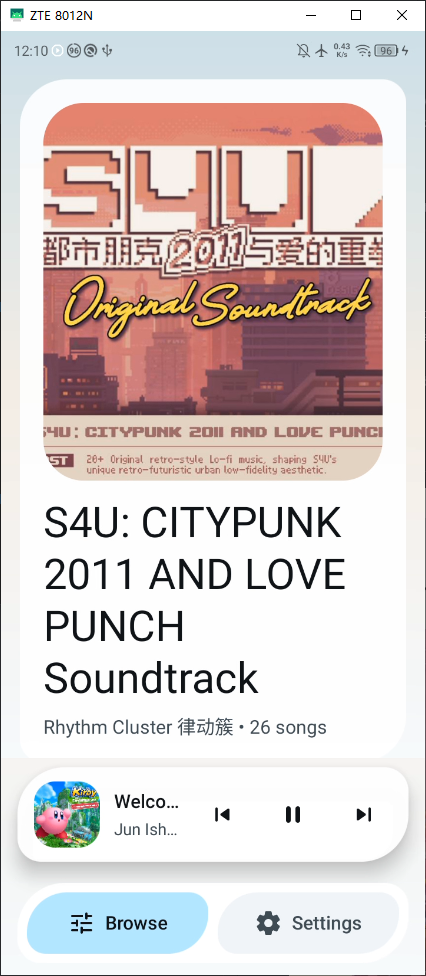
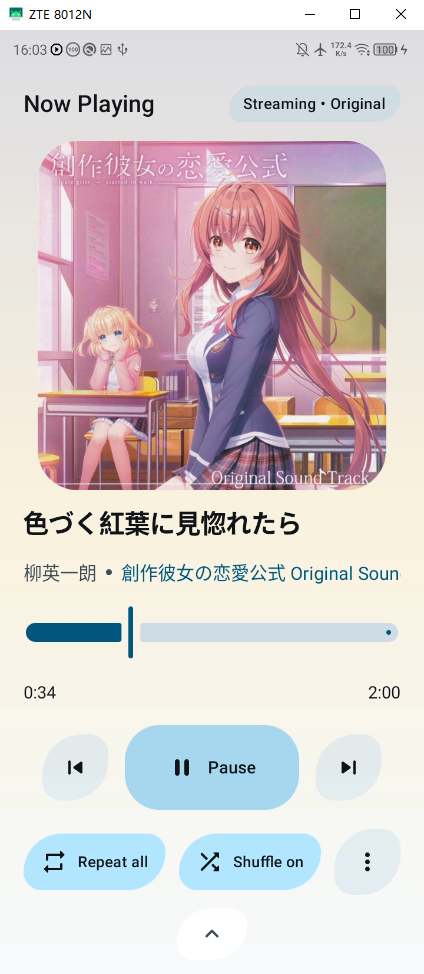
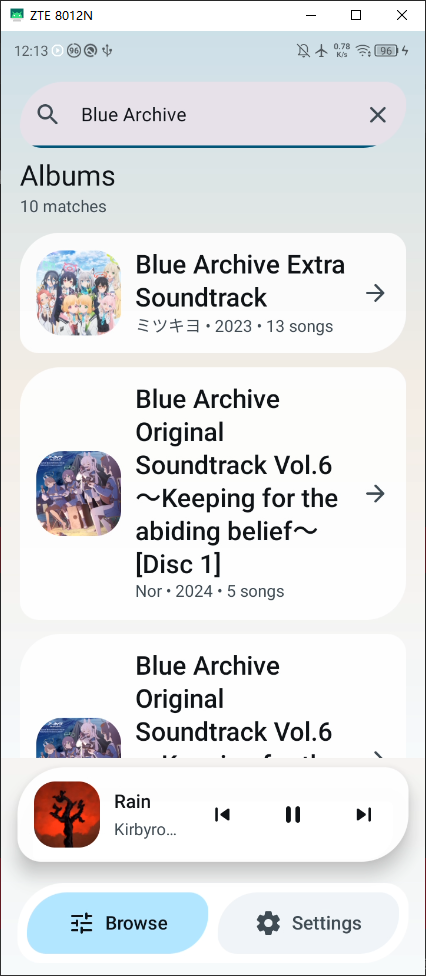

# Saki.Android

<!-- Add to your README -->

> [!NOTE]  
> This project actively uses GPT 5.4 (xhigh) to ship new functionality. Due to the nature of mobile application, some may not be tested thoroughly.

> [!IMPORTANT]  
> This project is in active development. It's still in an unstable state and is not ready for production use.

> [!WARNING]  
> Proceed with your own risk. This project is not fully tested. While the author is working on it, you are also welcome to submit issues and feature requests.

Saki.Android is an Android music player for subsonic compatible music servers in Material 3 Expressive.

## Screenshots

### Album List

### Now Playing

### Search

## Libraries and Frameworks

- [Kotlin 2.2.10](https://kotlinlang.org/)

- [Gradle 9.3.1](https://gradle.org/releases/) with [Android Gradle Plugin 9.1.1](https://developer.android.com/build/releases/gradle-plugin)

- [Jetpack Compose (BOM 2026.02.01)](https://developer.android.com/jetpack/compose) with [Material 3](https://developer.android.com/jetpack/compose/designsystems/material3)

- [AndroidX Core KTX 1.18.0](https://developer.android.com/jetpack/androidx/releases/core), [AndroidX Lifecycle 2.10.0](https://developer.android.com/jetpack/androidx/releases/lifecycle), and [AndroidX Activity Compose 1.13.0](https://developer.android.com/jetpack/androidx/releases/activity)

- [Hilt 2.57.1](https://dagger.dev/hilt/) for dependency injection

- [KSP (Kotlin Symbol Processing) 2.3.4](https://github.com/google/ksp) for code generation (Hilt, Room, Moshi)

- [Room 2.8.4](https://developer.android.com/jetpack/androidx/releases/room) for local database/storage

- [Kotlin Coroutines 1.10.2](https://github.com/Kotlin/kotlinx.coroutines) for async/concurrency

- [Retrofit 3.0.0](https://square.github.io/retrofit/) with [OkHttp 4.12.0](https://square.github.io/okhttp/) for networking

- [Moshi 1.15.2](https://github.com/square/moshi) for JSON (with KSP codegen)

- [Coil 3.4.0](https://coil-kt.github.io/coil/) with [OkHttp](https://square.github.io/okhttp/) as the network stack

- [AndroidX Media3 / ExoPlayer 1.10.0](https://developer.android.com/media/media3) with [OkHttp DataSource](https://developer.android.com/media/media3)

- [AndroidX Palette 1.0.0](https://developer.android.com/jetpack/androidx/releases/palette) for color extraction

- [JUnit 4.13.2](https://junit.org/junit4/), [AndroidX Test JUnit 1.3.0](https://developer.android.com/training/testing/instrumented-tests), and [Espresso 3.7.0](https://developer.android.com/training/testing/espresso)

- [OkHttp MockWebServer](https://square.github.io/okhttp/#mockwebserver) for network tests

